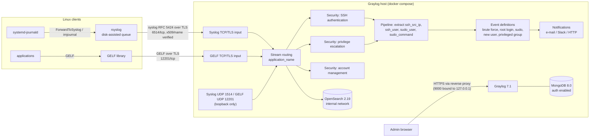

# graylog-central-logging

[](https://github.com/int3erlud3/graylog-central-logging/actions/workflows/ci.yml)


Central log management for Linux servers with **Graylog**. The repository contains:

- a pinned docker compose stack: Graylog 7.1 + OpenSearch 2.19 + MongoDB 8.0;
- **TLS log forwarding** for clients, using rsyslog plus journald;
- inputs, streams, a field-extraction pipeline and **security alert definitions**, provisioned
  through the REST API: failed SSH logins, sudo usage, new local users, privileged group changes.

Everything is tested end to end in CI. The stack is started, a real rsyslog client forwards
over TLS, and the alerts have to fire.

```text
                      _                          _            _
   __ _ _ _ __ _ _  _| |___  __ _ ___ __ ___ _ _| |_ _ _ __ _| |
  / _` | '_/ _` | || | / _ \/ _` |___/ _/ -_) ' \  _| '_/ _` | |
  \__, |_| \__,_|\_, |_\___/\__, |   \__\___|_||_\__|_| \__,_|_|
  |___/          |__/       |___/
   _                _
  | |___  __ _ __ _(_)_ _  __ _
  | / _ \/ _` / _` | | ' \/ _` |
  |_\___/\__, \__, |_|_||_\__, |
         |___/|___/       |___/

+====================================================================+
|  GRAYLOG CENTRAL LOGGING  ::  Log Collection & Security Alerts     |
+--------------------------------------------------------------------+
|  Graylog stack, TLS syslog forwarding, streams and alert rules     |
|  v1.0.0  -  Bastion Ops Toolkit  -  by int3erlud3                  |
+====================================================================+
```

## Architecture



## Security defaults

| Area | Default |
|---|---|
| Secrets | Only in `.env` (git-ignored, created with mode `0600` by `scripts/init-env.sh`). `.env.example` has empty values. Compose **refuses to start** while a secret is missing (`${VAR:?}`). |
| Admin password | Only its SHA-256 is stored. Provisioning reads it from a `0600` file or a prompt, never from arguments. |
| Network exposure | Web UI/API on `127.0.0.1:9000`. TLS inputs on `127.0.0.1` until you set `INPUT_BIND_ADDRESS`. UDP inputs are loopback only. MongoDB and OpenSearch are not published at all. |
| Transport | Syslog and GELF over TLS with a private CA (`scripts/gen-certs.sh`, ECDSA P-256). Clients verify the server name (`x509/name`). Optional mutual TLS (`--tls-client-auth required`). |
| MongoDB | Authentication enabled. Graylog uses a dedicated `readWrite`/`dbAdmin` user, not root. |
| Containers | Pinned image versions, `no-new-privileges`, log rotation, telemetry and version checks off. |
| Supply chain | GitHub Actions pinned to commit SHAs with `contents: read`, gitleaks over the full history. |

## Quick start

Requirements: Docker with compose v2, about 4 GB RAM, `openssl`, `jq`, `curl`.

```bash
# OpenSearch needs this on the Docker host
echo 'vm.max_map_count=262144' | sudo tee /etc/sysctl.d/99-opensearch.conf && sudo sysctl --system

scripts/init-env.sh                              # asks for the admin password, writes .env (0600)
scripts/gen-certs.sh server graylog.example.com     # CA + server certificate in ./certs (git-ignored)
sudo chown root:1100 certs/server/graylog.key       # readable by the graylog container user only
# to accept clients from the network: set INPUT_BIND_ADDRESS=<server LAN IP> in .env
docker compose up -d --wait

export GRAYLOG_PASSWORD_FILE=~/.graylog-admin.pw    # file with the admin password, chmod 600
scripts/provision.sh --verify
```

Open `http://127.0.0.1:9000/` (or an SSH tunnel) and log in as `admin`. For remote access,
publish the web interface through a TLS reverse proxy and set `GRAYLOG_HTTP_EXTERNAL_URI`.

## Provisioning

`scripts/provision.sh` reads the JSON definitions in [`provisioning/`](provisioning) and
creates the objects through the Graylog REST API. It is idempotent: objects with an
existing title are skipped. Input configurations are merged with the defaults that the API
reports for each input type, so the definitions only contain what matters.

| Object | Definitions |
|---|---|
| Inputs | Syslog TCP/TLS 6514, GELF TCP/TLS 12201, Syslog UDP 1514 and GELF UDP 12201 (local only) |
| Streams | `Security: SSH authentication` (sshd), `Security: privilege escalation` (sudo, su), `Security: account management` (useradd, usermod, gpasswd, ...) |
| Pipeline | `Security field extraction`: `ssh_user`, `ssh_src_ip`, `sudo_user`, `sudo_target_user`, `sudo_command` |
| Alerts | See the table below |

| Alert (event definition) | Priority | Logic |
|---|---|---|
| SSH brute force: 5+ failed logins on one host in 5 minutes | high | count >= 5 per `source` |
| SSH: failed login for root | normal | every match |
| sudo: command executed | low | every match (review trail) |
| sudo: authentication failure or policy violation | high | wrong password, `NOT in sudoers`, `command not allowed` |
| Account: new local user created | high | `useradd`/`adduser` "new user" |
| Account: user added to a privileged group | high | wheel / sudo / adm / root |

```text
scripts/provision.sh --dry-run              # validate the definitions and show the plan, no API calls
scripts/provision.sh --only streams,events  # partial run
scripts/provision.sh --tls-client-auth required --verify
```

Credentials come from the environment only: `GRAYLOG_API_TOKEN_FILE` (preferred) or
`GRAYLOG_USERNAME` plus `GRAYLOG_PASSWORD_FILE`. With neither set, the script prompts.
Credentials reach curl through a process-substitution config file, so they do not show up in
`ps`. Plain `http://` is only accepted for `localhost`. TLS verification cannot be turned off.
Use `GRAYLOG_CA_FILE` for a private CA. Exit codes: `0` OK, `1` API or verification error,
`2` usage or configuration error.

Notifications (e-mail, Slack, Teams, HTTP) depend on your environment. Create them in the web
interface and attach them to the event definitions.

## Linux clients: rsyslog over TLS

```bash
sudo dnf install rsyslog rsyslog-gnutls        # or: sudo apt install rsyslog rsyslog-gnutls
clients/install-rsyslog-forwarding.sh --target graylog.example.com --ca ca.pem          # dry-run
sudo clients/install-rsyslog-forwarding.sh --target graylog.example.com --ca ca.pem --apply
logger -t gcl-test 'hello graylog'
```

The installer does the following:

1. Installs the CA as `/etc/pki/graylog/ca.pem`.
2. Writes `/etc/rsyslog.d/60-graylog-tls.conf` from
   [the template](clients/rsyslog/60-graylog-tls.conf.template). The template uses TLS with
   server-name verification, RFC 5424 format, and a disk-assisted queue (up to 1 GB by default)
   that buffers logs while Graylog is unreachable.
3. Installs the journald drop-in [`90-forward-to-syslog.conf`](clients/journald/90-forward-to-syslog.conf),
   which sets `ForwardToSyslog=yes` and a persistent local journal.
4. On Debian/Ubuntu, where rsyslogd is confined by AppArmor, adds a read-only rule for
   `/etc/pki/graylog/` and reloads the profile. RHEL and SUSE SELinux policies already allow
   `/etc/pki`.
5. Validates the configuration with `rsyslogd -N1` and restarts rsyslog. If validation or the
   restart fails, the previous files are restored.

For mutual TLS, issue a client certificate with `scripts/gen-certs.sh client web01.example.com`
and pass `--client-cert/--client-key`. Systems that should read the journal directly can use
[`10-imjournal.conf`](clients/rsyslog/10-imjournal.conf). RHEL-family systems already load
imjournal.

## Testing

| Check | Where |
|---|---|
| `shellcheck` for all scripts, mocks and bats files; `yamllint`; `ruff` | CI `lint` |
| JSON syntax (`jq`) and the definitions validator (`scripts/validate-definitions.py`: references, unique titles and ports, TLS required on TCP inputs) | CI `lint` |
| `docker compose config` must fail without secrets or with the empty `.env.example`, must pass with them, and every image must be pinned | CI `lint` |
| 36 bats tests: provisioning against a simulated API (request bodies, idempotency, credential handling), secrets, certificates, client installer with AppArmor handling and rollback, banner | CI `test`, `bats tests/` |
| End to end: stack up, provision twice, syslog and GELF over TLS, certificate name check, stream routing, pipeline fields, real rsyslog client, three alerts firing | CI `integration`, `tests/integration.sh` |
| gitleaks over the full history | CI `security` |

## Layout

```text
docker-compose.yml                 Graylog + OpenSearch + MongoDB (pinned)
.env.example                       required secrets (empty)
mongo-init/                        creates the least-privilege MongoDB user
provisioning/                      inputs, streams, pipelines (*.rule), event definitions (JSON)
scripts/init-env.sh             .env with random secrets and the admin password hash
scripts/gen-certs.sh               private CA, server and client certificates
scripts/provision.sh               REST API provisioning (idempotent, --dry-run, --verify)
scripts/validate-definitions.py    offline validation of provisioning/
clients/                           rsyslog TLS template, journald drop-in, installer
tests/                             bats tests, API mock, integration test
```

## License

[MIT](LICENSE)
